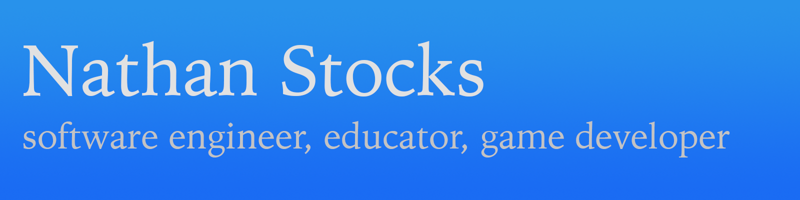

# Hi! I'm Nathan Stocks 👨🏻‍💻 👾 🎮 
Author of [Rusty Engine], Rust programming [instructor], open source maintainer, indie game developer. 

# 🚀 My Projects 

- [Rusty Engine] - 2D game engine for learning Rust
- [Bevy Template] - An opinionated Bevy project template with a configuration script to run for the more complex parts (like setting up the fast-compile setup).
- [Ultimate Rust Crash Course] - Exercises for my (for-pay) course of the same name on Udemy
- [Green] (maintainer) - a clean, colorful, fast Python test runner.
- [Invaders] - "Space Invaders" clone...in the terminal
- [Rusty Sword] - Conquer monsters in your terminal with your rusty sword
- [Punch Ball] - Punch your opponents out of the arena

# 🚟 More projects! 
- [Amethyst] - One of the first general-purpose 2D/3D game engines in Rust.
- [Bevy] - A refreshingly simple data-driven game engine built in Rust.
- [SkipNGo] -  A 2D game engine focused on retro top down games
- ...and [many more]

# 💖 Show Your Support 

If you would like to support me, you can do so via [GitHub Sponsors] or [Patreon].

[Amethyst]: https://amethyst.rs/
[Bevy Template]: https://github.com/cleancut/bevy_template
[Bevy]: https://bevyengine.org/
[Green]: https://github.com/CleanCut/green
[Rusty Engine]: https://github.com/CleanCut/rusty_engine
[many more]: https://github.com/pulls?q=is%3Amerged+is%3Apr+author%3Acleancut+archived%3Afalse+
[Invaders]: https://github.com/CleanCut/invaders/
[Python]: https://www.python.org/
[Rust]: https://rust-lang.org/
[Ultimate Rust Crash Course]: https://github.com/CleanCut/ultimate_rust_crash_course/
[Punch Ball]: https://github.com/CleanCut/punchball
[Rusty Sword]: https://github.com/CleanCut/rusty_sword/
[SkipNGo]: https://github.com/katharostech/skipngo
[Patreon]: https://www.patreon.com/nathanstocks
[instructor]: https://agileperception.com
[GitHub Sponsors]: https://github.com/sponsors/CleanCut
